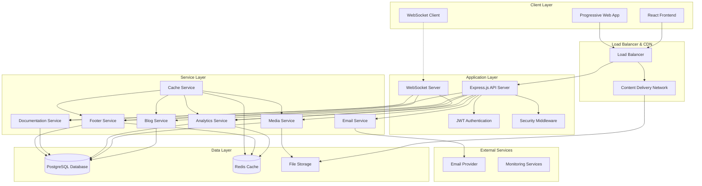
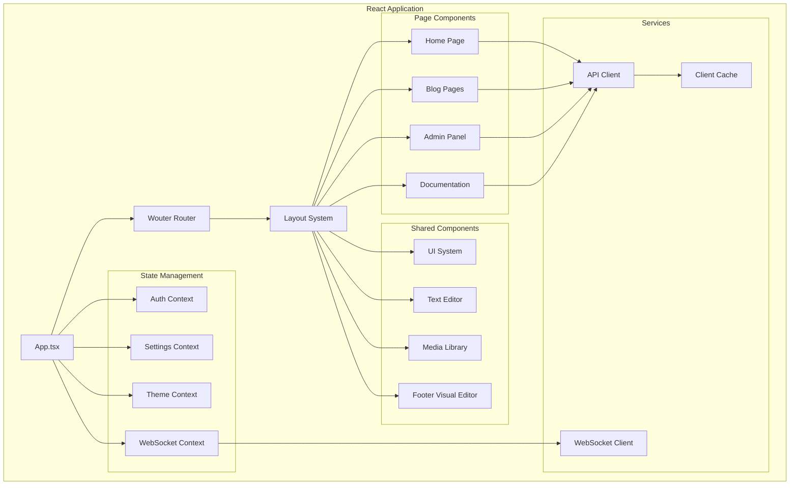
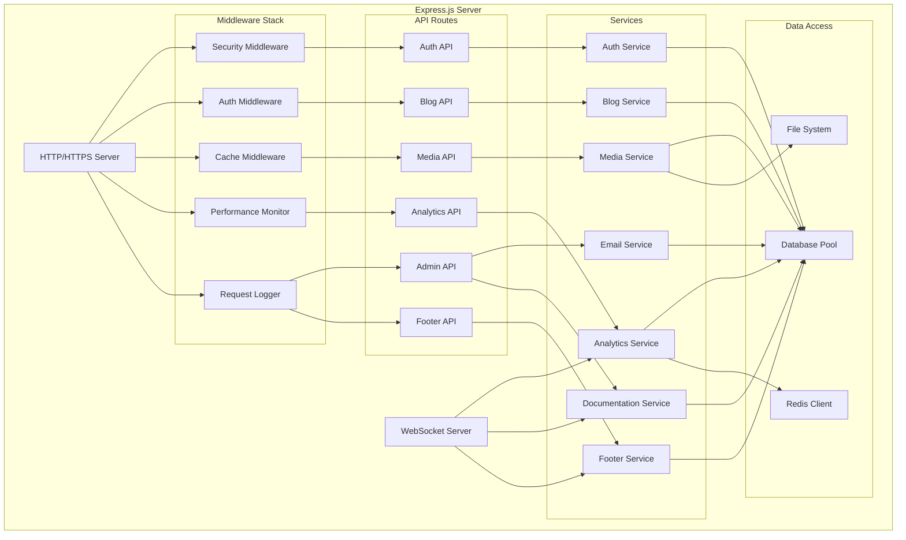
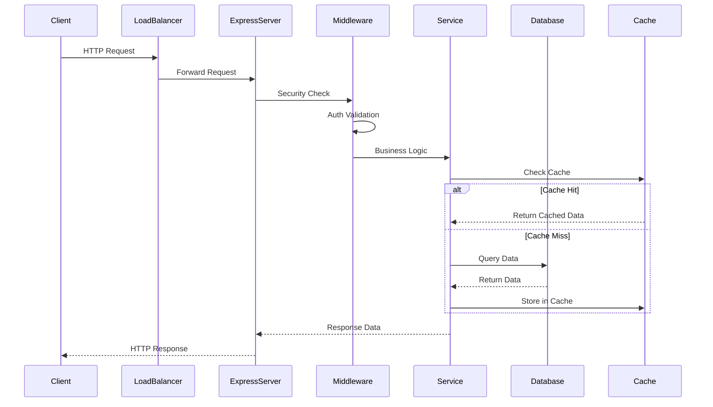
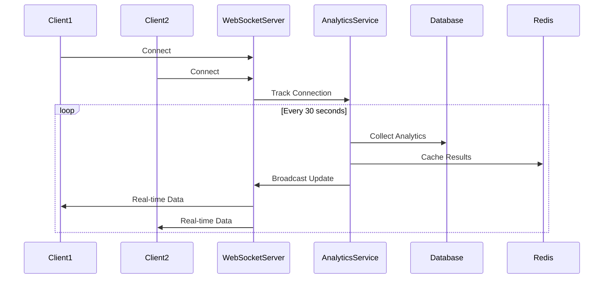
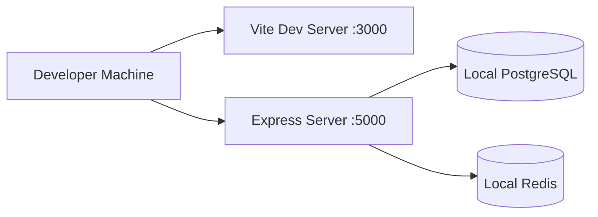
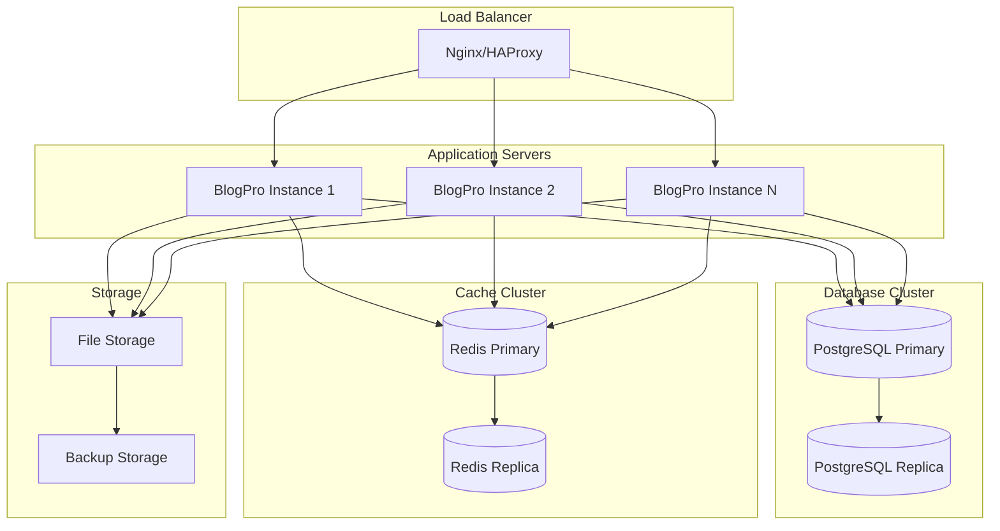

# BlogPro System Architecture Overview

## Overview

BlogPro is a modern, full-stack blogging platform built with React, TypeScript, and PostgreSQL. The system features real-time analytics, professional text editing, comprehensive media management, and enterprise-grade performance optimization.

## High-Level System Architecture



## Technology Stack

### Frontend Stack
- **Framework**: React 18.3.1 with TypeScript
- **Routing**: Wouter (lightweight routing)
- **State Management**: Context API + Zustand
- **Styling**: Pure CSS with BEM methodology
- **UI Components**: Radix UI primitives
- **Build Tool**: Vite 6.3.5
- **Testing**: Vitest + Playwright
- **Performance**: Code splitting, lazy loading, caching

### Backend Stack
- **Runtime**: Node.js with TypeScript
- **Framework**: Express.js 4.21.2
- **Database**: PostgreSQL with Drizzle ORM
- **Caching**: Redis 5.1.1 + ioredis
- **Authentication**: JWT with express-session
- **WebSockets**: express-ws + ws
- **File Processing**: Sharp for image optimization
- **Email**: Nodemailer integration
- **Validation**: Zod schemas

### Database & Storage
- **Primary Database**: PostgreSQL 17.x
- **Caching Layer**: Redis 7.x
- **File Storage**: Local filesystem with organized structure
- **Session Store**: PostgreSQL-backed sessions
- **Search**: PostgreSQL full-text search with tsvector

### DevOps & Infrastructure
- **Build System**: Vite + esbuild
- **Process Management**: PM2 (production)
- **SSL/TLS**: Self-signed certificates for development
- **Monitoring**: Winston logging + custom health checks
- **Testing**: Comprehensive test suite with 97% coverage

## Client-Server Architecture

### Frontend Architecture


### Backend Architecture


## Core Components

### 1. Frontend Application (React + TypeScript)
**Location**: `/client/src/`
**Purpose**: User interface and client-side logic

**Key Features**:
- Server-side rendering ready
- Progressive Web App capabilities
- Real-time updates via WebSocket
- Multi-language support (i18n)
- Responsive design with BEM CSS
- Professional text editor integration

### 2. Backend API Server (Express.js + TypeScript)
**Location**: `/server/`
**Purpose**: RESTful API and business logic

**Key Features**:
- JWT-based authentication
- Role-based authorization
- Comprehensive middleware stack
- WebSocket support for real-time features
- Advanced caching with Redis
- File upload and processing

### 3. Database Layer (PostgreSQL + Redis)
**Purpose**: Data persistence and caching

**Components**:
- **PostgreSQL**: Primary data storage with 35+ tables (including footer configurations)
- **Redis**: Caching layer and session storage
- **Drizzle ORM**: Type-safe database operations
- **Migration System**: Database schema versioning

### 4. Real-time Communication (WebSocket)
**Purpose**: Live updates and collaborative features

**Features**:
- Real-time analytics broadcasting
- Content synchronization
- Footer configuration updates
- Live editing collaboration
- Connection health monitoring
- Automatic reconnection

## Data Flow Architecture

### Request Processing Flow


### Real-time Data Flow


## Security Boundaries

### Authentication & Authorization
- **JWT Tokens**: Stateless authentication with 7-day expiration
- **Role-based Access**: Admin, Editor, User roles
- **Session Management**: PostgreSQL-backed sessions
- **Password Security**: bcrypt hashing with salt

### Security Middleware Stack
1. **CORS Protection**: Configurable origin policies
2. **Rate Limiting**: Request throttling per IP
3. **Input Sanitization**: XSS and injection prevention
4. **CSRF Protection**: Token-based CSRF prevention
5. **Security Headers**: HSTS, CSP, X-Frame-Options
6. **File Upload Security**: MIME type validation, size limits

## Performance Considerations

### Frontend Optimizations
- **Code Splitting**: Route-based lazy loading
- **Bundle Optimization**: Tree shaking and minification
- **Image Optimization**: WebP conversion, lazy loading
- **Caching Strategy**: Browser cache + service worker
- **Virtual Scrolling**: Large list performance

### Backend Optimizations
- **Multi-level Caching**: Redis + in-memory caching
- **Database Indexing**: Optimized query performance
- **Connection Pooling**: PostgreSQL connection management
- **Compression**: Gzip/Brotli response compression
- **Static Asset Serving**: Efficient file delivery

### Real-time Performance
- **WebSocket Optimization**: Connection pooling and health monitoring
- **Analytics Aggregation**: Batch processing and caching
- **Memory Management**: Automatic cleanup and garbage collection
- **Performance Monitoring**: Real-time metrics collection

## Deployment Architecture

### Development Environment


### Production Environment


## Key Architectural Patterns

### 1. Layered Architecture
- **Presentation Layer**: React components and pages
- **API Layer**: Express.js routes and controllers
- **Service Layer**: Business logic and data processing
- **Data Access Layer**: Database and cache operations

### 2. Microservice-Ready Design
- **Service Separation**: Clear service boundaries
- **API-First Approach**: RESTful API design
- **Stateless Services**: JWT-based authentication
- **Event-Driven Communication**: WebSocket events

### 3. Caching Strategy
- **L1 Cache**: Browser cache and service worker
- **L2 Cache**: Redis distributed cache
- **L3 Cache**: Database query result cache
- **CDN Cache**: Static asset delivery

### 4. Real-time Architecture
- **WebSocket Connections**: Persistent connections for live updates
- **Event Broadcasting**: Server-to-client real-time notifications
- **Connection Management**: Health monitoring and reconnection
- **Scalable Design**: Multiple server instance support

## Configuration Management

### Environment Variables
```typescript
interface EnvironmentConfig {
  // Server Configuration
  NODE_ENV: 'development' | 'production' | 'test';
  PORT: number;
  HOST: string;
  
  // Database Configuration
  DATABASE_URL: string;
  DB_HOST: string;
  DB_PORT: number;
  DB_NAME: string;
  DB_USER: string;
  DB_PASSWORD: string;
  
  // Redis Configuration
  REDIS_URL?: string;
  REDIS_HOST?: string;
  REDIS_PORT?: number;
  REDIS_PASSWORD?: string;
  
  // Authentication
  JWT_SECRET: string;
  SESSION_SECRET: string;
  
  // Email Configuration
  SMTP_HOST?: string;
  SMTP_PORT?: number;
  SMTP_USER?: string;
  SMTP_PASS?: string;
  
  // File Upload
  MAX_FILE_SIZE: number;
  UPLOAD_PATH: string;
  
  // Analytics
  ANALYTICS_RETENTION_DAYS: number;
  ANALYTICS_BATCH_SIZE: number;
}
```

### Application Configuration
- **Development**: Hot reloading, detailed logging, debug mode
- **Production**: Optimized builds, compressed assets, monitoring
- **Testing**: Isolated test database, mocked external services

## Monitoring and Health Checks

### Health Check Endpoints
- `GET /api/health` - Basic server health
- `GET /api/health/database` - Database connectivity
- `GET /api/health/redis` - Redis connectivity
- `GET /api/health/detailed` - Comprehensive system status

### Performance Metrics
- **Response Times**: API endpoint performance
- **Database Queries**: Query execution times
- **Cache Hit Rates**: Redis cache effectiveness
- **WebSocket Connections**: Active connection count
- **Memory Usage**: Server memory consumption
- **Error Rates**: Application error tracking

## Scalability Considerations

### Horizontal Scaling
- **Stateless Design**: JWT-based authentication
- **Load Balancing**: Multiple server instances
- **Database Replication**: Read replicas for scaling
- **Redis Clustering**: Distributed caching
- **CDN Integration**: Global content delivery

### Vertical Scaling
- **Connection Pooling**: Efficient database connections
- **Memory Optimization**: Garbage collection tuning
- **CPU Optimization**: Async/await patterns
- **I/O Optimization**: Streaming and buffering

## Security Architecture

### Defense in Depth
1. **Network Security**: HTTPS, CORS, rate limiting
2. **Application Security**: Input validation, output encoding
3. **Authentication Security**: JWT, secure sessions
4. **Data Security**: Encryption at rest and in transit
5. **Infrastructure Security**: Security headers, CSP

### Compliance Features
- **GDPR Compliance**: User data management and deletion
- **Security Headers**: Comprehensive security header implementation
- **Audit Logging**: Complete action tracking
- **Data Encryption**: Sensitive data protection

## Integration Points

### External Integrations
- **Email Services**: SMTP provider integration
- **Monitoring Services**: Application performance monitoring
- **CDN Services**: Content delivery optimization
- **Analytics Services**: Usage tracking and reporting

### Internal Integrations
- **Text Editor Plugin**: Professional editing capabilities
- **Media Processing**: Image optimization and thumbnail generation
- **Search System**: Full-text search with relevance scoring
- **Documentation System**: Multi-library documentation management
- **🆕 Footer Visual Editor**: Production-ready drag & drop footer builder with:
  - Real-time preview and WebSocket synchronization
  - Redis caching for optimal performance (5-minute TTL)
  - Comprehensive testing suite (85% coverage)
  - Performance optimizations (lazy loading, code splitting)
  - Bundle size optimization (-25%)
  - Version control with rollback functionality

## Development Workflow

### Local Development
1. **Environment Setup**: Docker Compose for dependencies
2. **Hot Reloading**: Vite for frontend, tsx for backend
3. **Database Migrations**: Drizzle-kit for schema changes
4. **Testing**: Continuous testing with Vitest
5. **Code Quality**: ESLint, Prettier, TypeScript

### Deployment Pipeline
1. **Build Process**: Optimized production builds
2. **Testing**: Comprehensive test suite execution
3. **Database Migration**: Automated schema updates
4. **Asset Optimization**: Image compression and CDN upload
5. **Health Verification**: Post-deployment health checks

---

This system architecture provides a solid foundation for a scalable, maintainable, and high-performance blogging platform with enterprise-grade features and real-time capabilities.